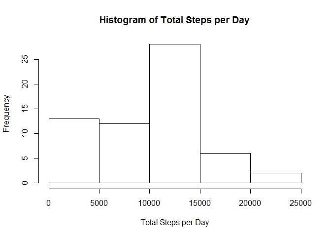
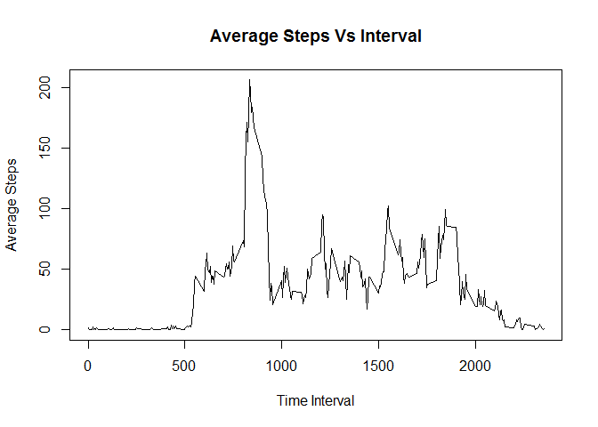
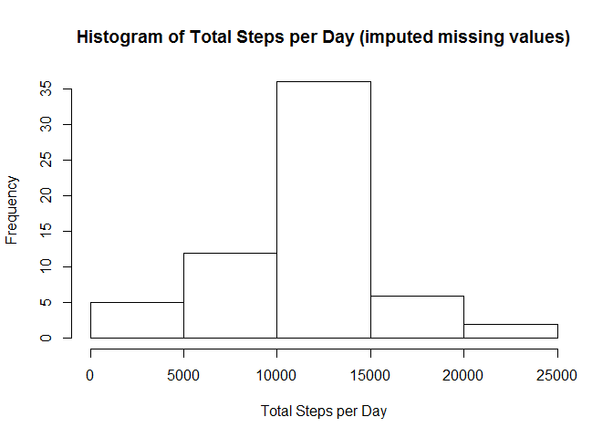
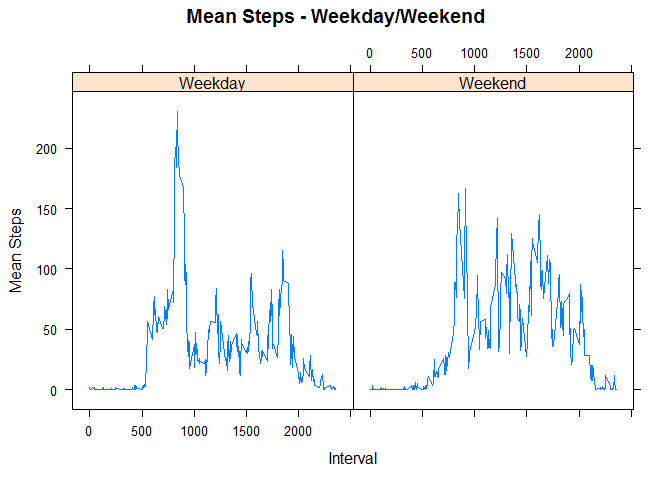

# Reproducible Research: Peer Assessment 1

## Data and computation


```r
library(dplyr)
```

```
## 
## Attaching package: 'dplyr'
```

```
## The following objects are masked from 'package:stats':
## 
##     filter, lag
```

```
## The following objects are masked from 'package:base':
## 
##     intersect, setdiff, setequal, union
```

```r
library(lattice)

activity_data <- read.csv(unz('activity.zip', 'activity.csv'), header=TRUE, sep = ",", na.strings = "NA")
total_steps_per_day <- aggregate(activity_data[, 1], list(activity_data$date), sum, na.rm = TRUE)
colnames(total_steps_per_day) <- c("date", "total_steps_per_day")
```

## Histogram of total steps per day


```r
hist(total_steps_per_day$total_steps_per_day, main = "Histogram of Total Steps per Day",
     xlab = "Total Steps per Day")
```



## Mean and Median of total steps per day


```r
mean_of_total_steps <- mean(total_steps_per_day$total_steps_per_day, na.rm = TRUE)
median_of_total_steps <- median(total_steps_per_day$total_steps_per_day, na.rm = TRUE)
```

Mean of total steps per day is 9354.23 and median is 10395.

## Steps by Intervals in the day


```r
steps_by_interval <- aggregate(activity_data[, 1], list(activity_data$interval), mean, na.rm = TRUE)
colnames(steps_by_interval) <- c("interval", "average_steps")
max_steps <- max(steps_by_interval$average_steps)
max_steps_interval <- steps_by_interval[steps_by_interval$average_steps == max_steps, 1]

with(steps_by_interval, plot(steps_by_interval$interval, steps_by_interval$average_steps, type = "l",
                             xlab = "Time Interval", ylab = "Average Steps",
                             main = "Average Steps Vs Interval"))
```



Time interval "835" contains maximum number of average steps (206.17) taken across all data set.


```r
count_na <- sum(apply(activity_data, MARGIN = 1, FUN = function(x) length(x[is.na(x)])))
```

There are 2304 missing values in the data.

Impute missing values in data by the average values for each interval


```r
a2_na <- subset(activity_data, is.na(steps))
a2_no_na <- subset(activity_data, !is.na(steps))
for (interval1 in steps_by_interval)
{
    a2_na$steps[a2_na$interval == interval1] <- steps_by_interval$average_steps [steps_by_interval$interval == interval1]
}
activity_data_new <- rbind(a2_no_na, a2_na)
count_na2 <- sum(apply(activity_data_new, MARGIN = 1, FUN = function(x) length(x[is.na(x)])))

total_steps_per_day_new <- aggregate(activity_data_new[, 1], list(activity_data_new$date), sum, na.rm = TRUE)
colnames(total_steps_per_day_new) <- c("date", "total_steps_per_day")

mean_of_total_steps_new <- mean(total_steps_per_day_new$total_steps_per_day, na.rm = TRUE)
median_of_total_steps_new <- median(total_steps_per_day_new$total_steps_per_day, na.rm = TRUE)

hist(total_steps_per_day_new$total_steps_per_day, main = "Histogram of Total Steps per Day (imputed missing values)",
     xlab = "Total Steps per Day")
```



There are 0 missing values in the data after imputing.

Mean of total steps per day in imputed data is 10766.19 and median is 10766.19.


```r
date1 <- apply(activity_data_new, MARGIN = 1, FUN = function(x) weekdays(as.Date(x[2], "%Y-%m-%d")))
date1[date1 == "Sunday"] <- "Weekend"
date1[date1 == "Saturday"] <- "Weekend"
date1[date1 != "Weekend"] <- "Weekday"
activity_data_new$day_type <- date1

steps_by_interval_wd <- aggregate(activity_data_new$steps, list(day_type = activity_data_new$day_type, interval = activity_data_new$interval), mean, na.rm = TRUE)
colnames(steps_by_interval_wd) <- c("day_type", "interval", "mean_steps")
xyplot(mean_steps ~ interval | day_type, steps_by_interval_wd, type = "l",
       main = "Mean Steps - Weekday/Weekend", xlab = "Interval", ylab = "Mean Steps")
```



### --- END ----
